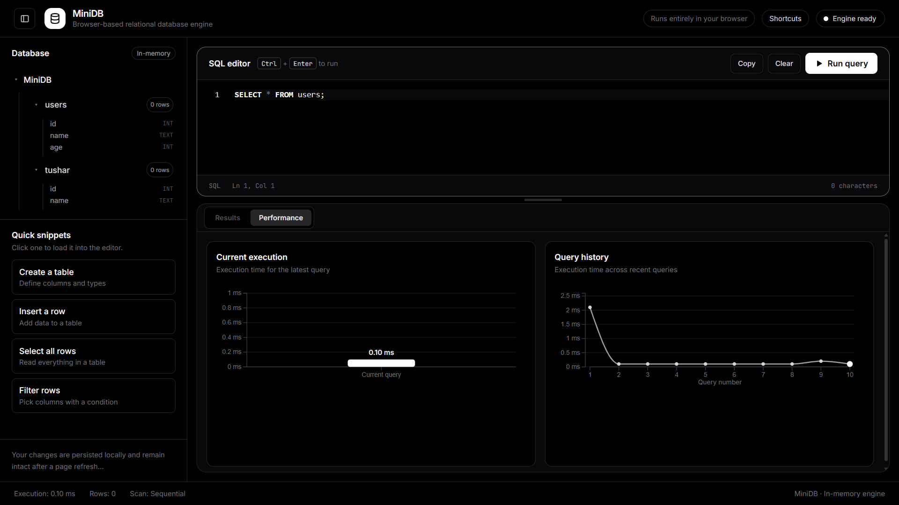

# MiniDB

### A relational database engine built from scratch in Vanilla JavaScript.

MiniDB is a browser-based relational database engine created to explore how databases work internally.

Instead of relying on an existing SQL engine, MiniDB implements its own SQL pipeline — starting from lexical analysis and parsing, converting queries into an AST, executing them against in-memory tables, and gradually adding persistence, indexing, transactions, and query visualization.

The project is intentionally kept small and readable so that every major part of the database can be understood and experimented with.

---

## Preview

<p align="center">
  
</p>

---

## What MiniDB Supports

### SQL & Query Processing

- SQL Lexer / Tokenizer
- Recursive Descent Parser
- Abstract Syntax Tree (AST)
- Query Executor
- `CREATE TABLE`
- `DROP TABLE`
- `INSERT`
- `SELECT`
- `UPDATE`
- `DELETE`
- `WHERE`
- `AND` / `OR`
- Comparison operators
- `ORDER BY`
- `LIMIT`
- Aggregate functions
- `GROUP BY`
- `HAVING`

### Tables & Data

- Schema management
- Multiple tables
- Basic data types
- Primary keys
- Unique constraints
- `NOT NULL`
- Default values
- Row validation
- Constraint validation

### Storage

- In-memory database
- IndexedDB persistence
- Database explorer
- Table explorer
- Query history

### Query Execution

- Sequential table scans
- Index-based lookup
- Query execution statistics
- Execution steps
- Query execution plans
- Basic query optimization

### Visualization

MiniDB uses D3.js to make normally invisible database operations easier to understand.

Planned / implemented visualizations include:

- SQL tokens
- AST structure
- Query execution plan
- Query execution time
- Query history

---

## Query Execution

A SQL query goes through multiple stages before the final result is produced.

```text
                    SQL Query
                        │
                        ▼
                ┌─────────────┐
                │    Lexer    │
                │             │
                │ SQL → Tokens│
                └──────┬──────┘
                       │
                       ▼
                ┌─────────────┐
                │   Parser    │
                │             │
                │Tokens → AST │
                └──────┬──────┘
                       │
                       ▼
                ┌─────────────┐
                │     AST     │
                │             │
                │ Query Model │
                └──────┬──────┘
                       │
                       ▼
                ┌─────────────┐
                │  Executor   │
                │             │
                │ AST → Ops   │
                └──────┬──────┘
                       │
                       ▼
              ┌──────────────────┐
              │     Database     │
              │                  │
              │ Tables / Indexes │
              └────────┬─────────┘
                       │
                       ▼
                ┌─────────────┐
                │   Storage   │
                │  IndexedDB  │
                └─────────────┘
                       │
                       ▼
                   Query Result
```

This pipeline is the core of MiniDB — the same query moves through each stage, with every stage having a specific responsibility.

---

## Project Structure

```text
minidb/
│
├── index.html
├── README.md
│
└── src/
    ├── main.js
    ├── database.js
    ├── lexer.js
    ├── parser.js
    ├── executor.js
    ├── storage.js
    ├── ui.js
    ├── visualizer.js
    └── editor.js
```

### Core Files

| File | Responsibility |
|---|---|
| `main.js` | Application entry point and query flow |
| `database.js` | Database and table management |
| `lexer.js` | SQL tokenization |
| `parser.js` | SQL parsing and AST generation |
| `executor.js` | Executes parsed queries |
| `storage.js` | IndexedDB persistence |
| `ui.js` | User interface and query results |
| `visualizer.js` | D3.js visualizations |
| `editor.js` | Monaco SQL editor |

---

## Tech Stack

- Vanilla JavaScript
- ES Modules
- HTML
- Tailwind CSS
- IndexedDB
- Monaco Editor
- D3.js
